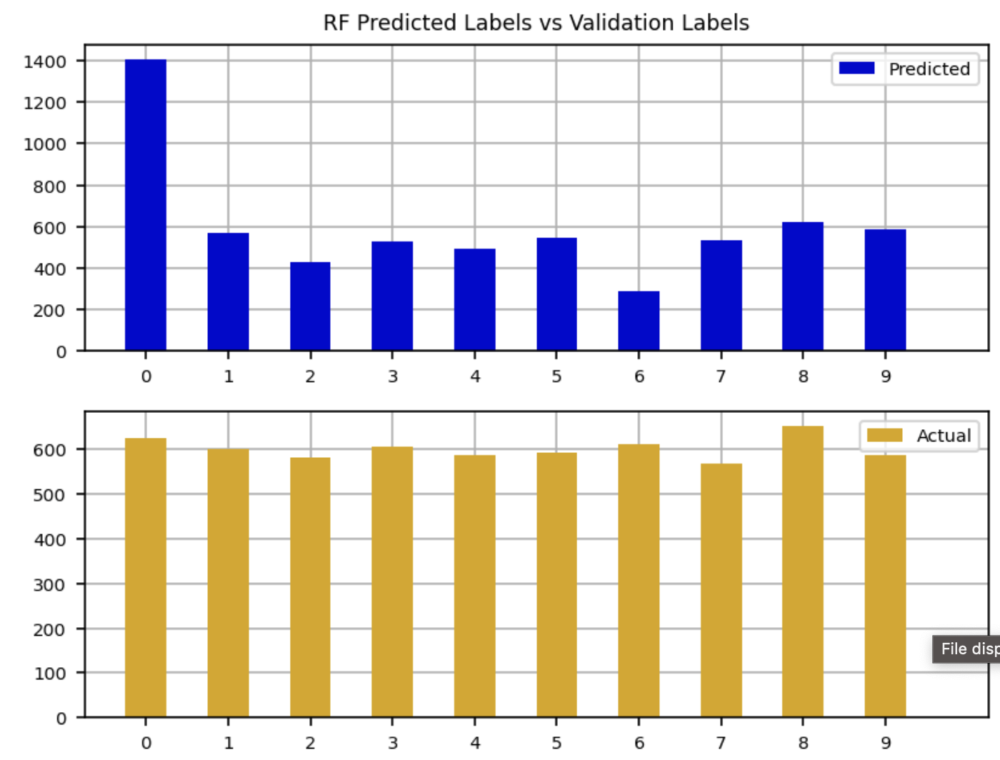

<p align="center">
  
</p>

# Analyzing Fashion-MNIST with Machine Learning
### W200 Project 2 | Trevor Lang, Ryan Powers, Carmen Liang
> Comparing the performance of Random Forest and Convolutional Neural Network (CNN) models for classifying 70,000 fashion product images.

<p align="center">
  
  
  
  
</p>

---

## 🚀 At-a-Glance

This repository explores two machine learning approaches for the Fashion-MNIST dataset. Here's what you'll find:

* **Project Report:** [**Read the full PDF Report**](Project_Report.pdf)
* **Project Slides:** [**View the Presentation Slides**](Project_Slides.pdf)
* **Notebook 1:** [**Random Forest Classifier**](1_Random_Forest_Classifier.ipynb)
* **Notebook 2:** [**CNN Classifier**](2_CNN_Classifier.ipynb)

---

## 📖 Project Overview

The goal of this project was to address the following research question:

> *How does the distribution of images across different classes in the Fashion-MNIST dataset affect the performance of Random Forest and Convolutional Neural Network (CNN) algorithms?*

We implemented, trained, and evaluated both models from scratch to compare their effectiveness in a real-world image classification task.

## 💾 The Dataset

We used the **Fashion-MNIST dataset**, a popular "drop-in replacement" for the original MNIST dataset, which is more complex and provides a better benchmark for modern ML algorithms.

<p align="center">
  
  <br>
  <em>A sample of images from the Fashion-MNIST dataset, illustrating the 10 distinct classes.</em>
</p>

* **Contents:** 70,000 grayscale images (60k training, 10k test)
* **Image Size:** $28 \times 28$ pixels
* **Classes:** 10 categories of fashion products

## 🤖 Models & Methodology

We implemented two distinct models to compare a classical machine learning approach with a deep learning approach.

1.  **Random Forest (RF):** An ensemble learning method that builds multiple decision trees. We used this to see how a strong, non-neural-network model would perform on raw pixel data.
    * *Implementation:* `scikit-learn`

2.  **Convolutional Neural Network (CNN):** A deep learning architecture specifically designed for computer vision. CNNs are built to automatically and adaptively learn spatial hierarchies of features from images.
    * *Implementation:* `TensorFlow` and `Keras`

<p align="center">
  
  <br>
  <em>Our 4-step process: 1. Data Loading, 2. Model Implementation, 3. Training & Evaluation, 4. Comparison.</em>
</p>

## 📊 Results: RF vs. CNN

Our analysis showed a clear performance difference. The CNN, which is designed for spatial data like images, significantly outperformed the Random Forest model.

### Performance Comparison

| Model | Final Accuracy | Key Observation |
| :--- | :---: | :--- |
| **Random Forest** | ~82% | Struggled to distinguish between similar classes (e.g., "Shirt" vs. "T-shirt/top"). |
| **CNN** | **~92%** | Effectively learned image features, leading to high accuracy and better generalization. |

### Visualizing Model Performance

Here is a direct visual comparison of the models' predictions and their confusion matrices.

| Random Forest | Convolutional Neural Network (CNN) |
| :---: | :---: |
| **Prediction Plot (16 Images)** | **Prediction Plot (16 Images)** |
|  | **(Placeholder)** <br> *[Add CNN prediction plot here]* |
| *The RF model making several errors (in red) on similar items like "shirt" and "top".* | *CNN model plot will show fewer errors.* |
| **Confusion Matrix** | **Normalized Confusion Matrix** |
|  | **(Placeholder)** <br> *[Add CNN confusion matrix here]* |
| *The RF matrix shows significant confusion between classes 0, 2, 4, and 6 (T-shirt, Pullover, Coat, Shirt).* | *CNN matrix will show a cleaner diagonal line.* |

---

## 🧠 Random Forest Model Deep-Dive

For a deeper look at the Random Forest model's behavior and performance characteristics:

| Confidence vs. Accuracy | Prediction Histogram | Predicted vs. Actual Labels |
| :---: | :---: | :---: |
|  |  |  |
| *This plot shows how the model's accuracy changes with its predicted confidence levels.* | *A histogram of the prediction probabilities for the validation data, indicating model certainty.* | *Compares the distribution of labels predicted by the RF model against the actual validation set labels.* |

---

## 🛠️ How to Run This Project

To replicate our analysis and run the models:

1.  **Clone the repository:**
    ```bash
    git clone [https://github.com/rPowDS/Project-1.git](https://github.com/rPowDS/Project-1.git)
    cd Project-1
    ```

2.  **Install the required libraries.** We recommend using a virtual environment.
    ```bash
    pip install -r requirements.txt
    ```

3.  **Run the Jupyter Notebooks:**
    * For the Random Forest model: `1_Random_Forest_Classifier.ipynb`
    * For the CNN model: `2_CNN_Classifier.ipynb`
